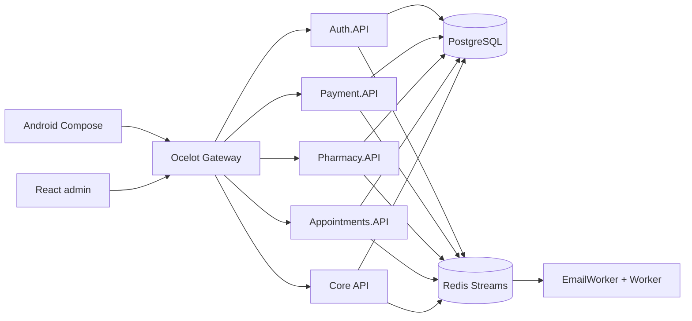

# Abraham Sanchez Olea

**Senior Software Engineer** — distributed systems, .NET, cloud, LLMOps  
Guadalajara, Mexico

[Resume](https://github.com/abraham-sanchez-olea/resume) · [Interactive CV](https://abraham-sanchez-olea.github.io/resume/) · [LinkedIn](https://www.linkedin.com/in/abraham-sanchez-olea-472b97b) · [abrsanchez@gmail.com](mailto:abrsanchez@gmail.com)

I design and operate enterprise backends: **.NET microservices**, event-driven integration (Kafka, Redis Streams), SQL Server / PostgreSQL, and multi-cloud (Azure, GCP, AWS). Recent work is **LLMOps** — observability for agents (Langfuse, tracing, alerting) and RAG on Azure OpenAI.

---

## Featured: AMEFA — health-tech membership platform

Personal venture. I designed, built, and operate the whole system: Android, admin web, API gateway, four extracted microservices, core API, workers, payments, and VPS deploy.

**Start here (public, detailed):** **[AMEFA-platform](https://github.com/abrsanchezolea/AMEFA-platform)**  
Architecture, every service, domain, clients, and end-to-end flows. Source stays private.

  
  

**What it is.** Families buy a medical membership, find a partner pharmacy on a map, book a consultation, and check in with a QR. Pharmacy staff run the day calendar. Admins run users, doctors, and pharmacies from the web.

**How it is built.**

| Piece | What I implemented |
| --- | --- |
| **Gateway** | Ocelot, JWT, CORS, rate limits — only public HTTP surface |
| **Auth.API** | Register, login, 2FA (web), JWT, FCM, member QR |
| **Payment.API** | Stripe PaymentIntents, signed webhooks, idempotent membership activation |
| **Pharmacy.API** | Geo catalog, schedules, slots, mobile sync, `pharmacy.updated` |
| **Appointments.API** | Booking, pharmacy day/month, QR validate/confirm |
| **Core API** | Admin, patients, membership, locations, images, sync |
| **Workers** | Stripe reconciliation, appointment state machine, holidays, Brevo email outbox |
| **Android** | Kotlin / Compose — member + pharmacy, Stripe, maps, biometrics |
| **Web** | React / Vite — marketing + admin/pharmacy panel |
| **Ops** | Docker Compose, GHCR, GitHub Actions → DigitalOcean |

Patterns: Clean Architecture, strangler extraction from a monolith, **shared-schema PostgreSQL**, transactional **outbox + Redis Streams**, `/alive` `/health` `/ready` on every process.

Read the full breakdown: **[abrsanchezolea/AMEFA-platform](https://github.com/abrsanchezolea/AMEFA-platform)**

---

## Also building

**TraceSuite** — observability platform for APIs, workers, and event-driven services (gateway, auth, payments, events, workers). Same operational discipline as the LLM observability work at GlobalLogic (Langfuse, tracing, alerting, RAG).

---

## Experience snapshot

| When | Role |
| --- | --- |
| 2025 – now | **Integration Engineer, GlobalLogic** — LLM observability, Langfuse, RAG, Azure OpenAI |
| 2022 – 2025 | **Sr Software Engineer, Charger Logistics** — Kafka, load-management microservices, multi-cloud Azure/GCP/AWS |
| 2023 – 2025 | **Freelance fullstack, Nautius** — .NET 8 + Angular time cards / payroll *(concurrent)* |
| 2021 – 2022 | **Senior Staff Software Engineer, Nagarro** |
| 2015 – 2021 | **Senior Software Engineer, Dextra / J.J. Keller** — compliance, IRS 2290, ELD |
| 2009 – 2013 | **Software Engineer, SisLogic** — GIS / cadastral (IGECEM, Oracle Spatial) |

Full bullets, education, and certifications: **[resume](https://github.com/abraham-sanchez-olea/resume)** · **[PDF-ready page](https://abraham-sanchez-olea.github.io/resume/)**

---

## Stack I use daily

`C#` `.NET 8/9` `ASP.NET` `Clean Architecture` `SQL Server` `PostgreSQL` `MongoDB` `Kafka` `Redis` `Azure` `Docker` `GitHub Actions` `Langfuse` `Azure OpenAI` `Angular` `React` `Kotlin`
